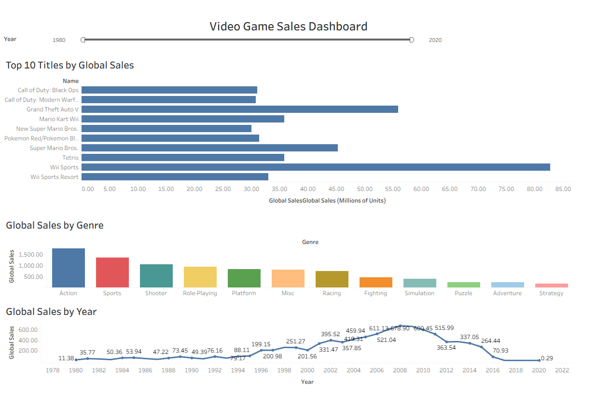

# Video Game Global Sales Dashboard

This repository contains a Tableau dashboard exported as a packaged workbook (.twbx).

## Dashboard Preview

## Overview

Visualizes global video game sales with interactive views for top 10 titles, sales by genre, and sales trends by year. The dashboard was originally published on Tableau Public for online viewing.

## Files

- `VideoGameSalesDashboard.twbx` – Packaged Tableau workbook including data and visualizations  
- `dashboard_screenshot.png` – Preview image of the dashboard  
- `README.md` – Project documentation  

## Data Workflow

1. The **Video Game Sales dataset (`vgsales.csv`)** was uploaded to **Snowflake**, a cloud data warehouse.  
2. SQL queries were used to explore and aggregate the data, including analysis of:
   - Sales by platform
   - Sales by genre
   - Top-selling titles  
3. Tableau Desktop was used to create the **interactive dashboard** using insights from these queries.

> Note: The Tableau workbook contains all data required to open and interact with the dashboard, so Snowflake is **not required** to view the visualizations locally.  

## How to Use

1. Download the `.twbx` file from this repository.
2. Open it in Tableau Desktop or Tableau Public.
3. Explore the interactive visualizations and filters.

## Tableau Public Link

View the dashboard online:

https://public.tableau.com/app/profile/larry.zelnick/viz/VideoGameGlobalSalesDashboard_17734886010920/VideoGameSalesDashboard?publish=yes

## Notes

- The `.twbx` file contains all data required to open and interact with the dashboard.
- Make sure you have Tableau Desktop or Tableau Public installed to view the workbook.
